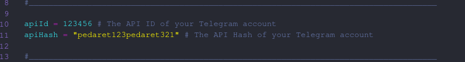

# Tadder
Adds members of another group to another group

# Tips before using the script

- Getting api id and api hash account from Telegram <a href="https://my.telegram.org/auth">URL</a>

- Add your API ID in line 10
- Add your API hash in line 11



# Installation

Instructions on how to install *Tadder*
```
git clone https://github.com/BlackFoxTM/Tadder.git
```
Go to the directory
```
cd Tadder
```
install requirements
```
pip3 install -r requirements.txt
```

See Help
```
python3 Tadder.py --help
```

-----------------------------------------------
|       Description      |      Switch        |
|------------------------|--------------------|
|  member extraction     |  `--ex or -e`      |   
|    Add members         |  `--add or -a`     | 
-----------------------------------------------

## Note : In --add (groupid) --add username_group without @
